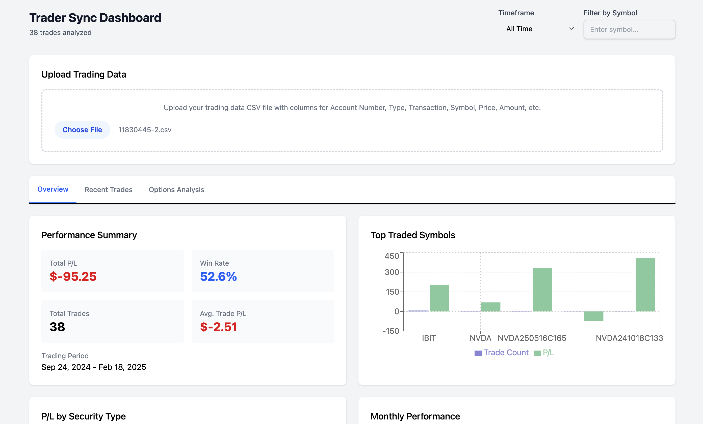

# Trader Sync Dashboard

A React-based trading analytics dashboard that helps traders visualize and analyze their trading performance from CSV data.



## Features

- **Trade Performance Analysis**: Calculate accurate P/L by matching opening and closing positions
- **Interactive Charts**: Visualize your trading performance with responsive charts
- **Options Analysis**: Track call vs. put performance and analyze options trades by underlying
- **Filtering**: Filter your trading data by timeframe and symbol
- **Trade Matching**: FIFO (First-In-First-Out) position matching for accurate P/L calculation
- **CSV Import**: Direct file upload and parsing of trading data

## Installation

```bash
# Clone the repository
git clone https://github.com/yourusername/trader-sync-dashboard.git

# Navigate to the project directory
cd trader-sync-dashboard

# Install dependencies
npm install

# Start the development server
npm start
```

## Usage

1. **Upload CSV File**: Use the file upload component to import your trading data
2. **Analyze Performance**: View your performance metrics in the Overview tab
3. **Examine Trades**: Review completed trades and individual transactions in the Trades tab
4. **Options Analysis**: Analyze options performance in the dedicated Options tab
5. **Filter Data**: Use the timeframe and symbol filters to focus on specific trading periods or instruments

## CSV Format

The dashboard expects a CSV file with the following columns:

| Column Name | Description |
|-------------|-------------|
| Account Number | Your trading account identifier |
| Type | Security type (e.g., Margin, Cash) |
| TradeInd | Trade indicator |
| Transaction | Transaction type (Buy, Sell) |
| Quantity | Number of shares/contracts |
| Symbol | The ticker symbol |
| CallPut | Option type (CALL, PUT) if applicable |
| UnderlyingSymbol | The underlying asset for options |
| ExpireDate | Expiration date for options |
| StrikePrice | Strike price for options |
| Activity Date | Date of the transaction |
| Price | Transaction price |
| Amount | Transaction amount |
| Commission | Trading commission |

## How P/L is Calculated

The dashboard calculates profit and loss by matching opening (buy) and closing (sell) positions:

1. Trades are sorted chronologically
2. Buy transactions create opening positions
3. Sell transactions are matched against opening positions using FIFO
4. P/L is calculated as: `closeAmount - openAmount`
   - Where `closeAmount = (closePrice * quantity) - commission`
   - And `openAmount = (openPrice * quantity) + commission`

This approach provides more accurate P/L calculations than simply summing transaction amounts.

## Technologies Used

- **React**: Frontend framework
- **Recharts**: Data visualization library
- **PapaParse**: CSV parsing library
- **Lodash**: Utility functions
- **Tailwind CSS**: Styling

## Customization

### Adding New Metrics

To add new metrics, modify the `calculateSummary` function in the main component:

```javascript
// Example: Adding a new metric for average hold time
const avgHoldTime = _.meanBy(closedTrades, trade => {
  const openDate = new Date(trade.openDate);
  const closeDate = new Date(trade.closeDate);
  return (closeDate - openDate) / (1000 * 60 * 60 * 24); // days
});

setSummary({
  // existing metrics
  avgHoldTime,
  // other metrics
});
```

### Custom Styling

The dashboard uses Tailwind CSS for styling. Modify the classes in the component to customize the appearance.

## License

MIT

## Contributing

Contributions are welcome! Please feel free to submit a Pull Request.

1. Fork the repository
2. Create your feature branch (`git checkout -b feature/amazing-feature`)
3. Commit your changes (`git commit -m 'Add some amazing feature'`)
4. Push to the branch (`git push origin feature/amazing-feature`)
5. Open a Pull Request